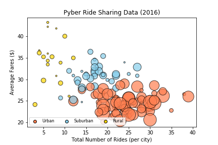
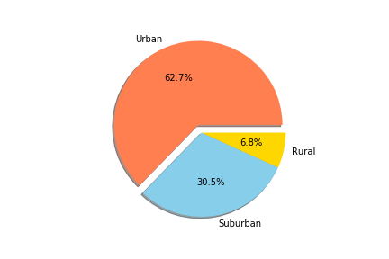
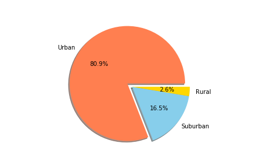
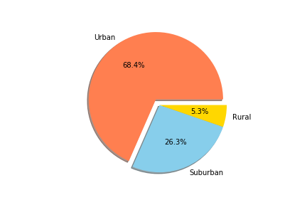

# Ride-Sharing-Analysis-With-Python
Used Pandas and Matplotlib to analyze ride sharing data.

Built a Bubble Plot that showcases the relationship between:

* Average Fare ($) Per City
* Total Number of Rides Per City
* Total Number of Drivers Per City
* City Type (Urban, Suburban, Rural)

Bult three pie charts that show:

* % of Total Fares by City Type
* % of Total Rides by City Type
* % of Total Drivers by City Type

